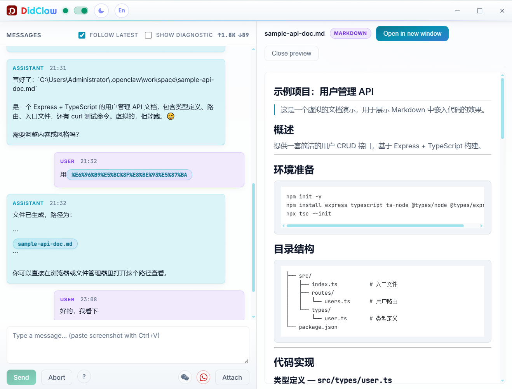
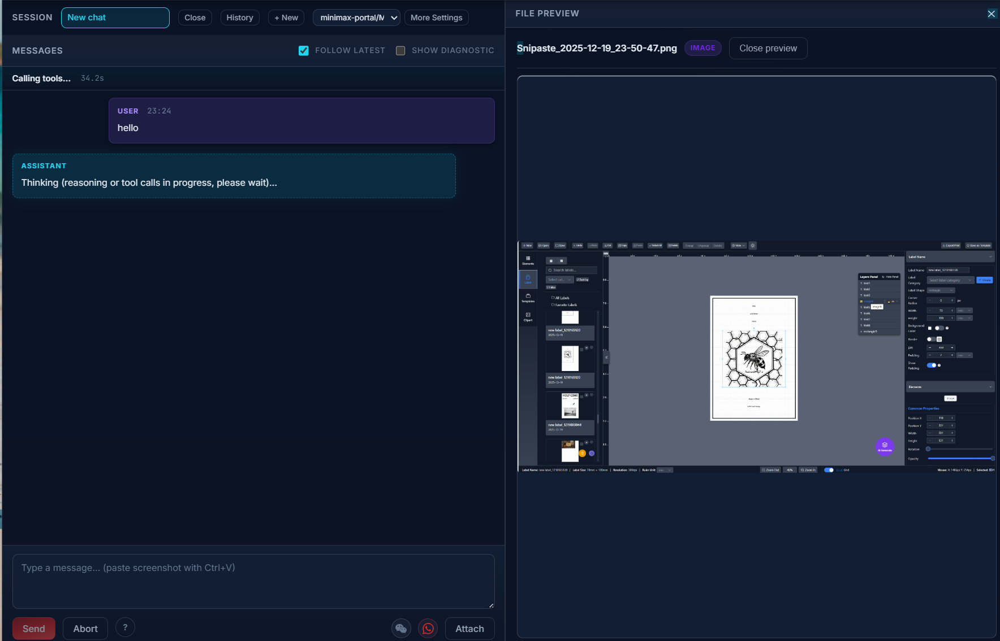

<div align="center">

# DidClaw

**The OpenClaw AI Desktop Client for Everyone**

[English](README.md) · [简体中文](README.zh-CN.md)

[Features](#features) · [Why DidClaw](#why-didclaw) · [Quick Start](#quick-start) · [Architecture](#architecture) · [Development](#development) · [License](#license)

[](https://github.com/didclawapp-ai/didclaw)
[](LICENSE)
[](https://tauri.app)

</div>

---

## Overview

**DidClaw** makes AI agents accessible to every user. Built on top of the [OpenClaw](https://openclaw.ai) Gateway, it turns command-line AI orchestration into an intuitive desktop experience — no terminal, no YAML files.

Command AI through WeChat or WhatsApp, preview files generated by AI in any format, schedule automated AI tasks — all from a clean interface. Every piece of data and configuration stays on your machine, never touching a cloud service.

<br/>

<div align="center">
  
  <br/><br/>
  <sub><i>Multi-channel AI control · File preview · Scheduled tasks · One app, everything included.</i></sub>
</div>

<br/>

---

## Why DidClaw

Powerful AI shouldn't be reserved for technical users. DidClaw's design philosophy is simple: **advanced technology deserves an interface that respects users' time.**

| Pain Point | DidClaw Solution |
|------------|-----------------|
| Complex CLI setup | Guided installation wizard, one-click environment bootstrap |
| Opaque config files | Visual settings panel with real-time validation |
| Managing gateway processes | Automatically supervises the OpenClaw subprocess lifecycle |
| Switching between AI providers | Unified provider config with one-click switching |
| Hard-to-install skills/plugins | Built-in ClawHub skill marketplace |
| Dealing with many file formats | Built-in multi-format preview (PDF / Image / Markdown / Code / Office) |

---

## Features

### Zero-Barrier Onboarding

Complete the journey from installation to first AI conversation entirely through a graphical interface — no terminal commands, no config files. A setup wizard launches automatically on first run.

### Multi-Channel AI Control

Send instructions to AI through WeChat, WeCom, WhatsApp, Telegram, Feishu, Discord, Slack, Microsoft Teams, LINE, Google Chat, and more. Each channel runs independently and can be paired with a dedicated AI agent.

### Multi-Format File Preview — Our Killer Feature

AI generates files. You need to see them *right there*, without switching apps.  
DidClaw embeds a full-featured preview panel that handles virtually every format you'll encounter:

| Category | Formats |
|----------|---------|
| Images | PNG · JPEG · GIF · WebP · SVG |
| Documents | PDF (inline rendering) |
| Rich Text | Markdown (live rendering with syntax highlight) |
| Code | 60+ languages with syntax highlighting |
| Office | DOCX · XLSX · PPTX (via LibreOffice or Office Online) |
| Plain Text | TXT · LOG · CSV |

<div align="center">
  
  <br/><br/>
  <sub><i>AI sends back a file — you see it instantly, right inside the chat.</i></sub>
</div>

<br/>

### Execution Approval (Human-in-the-Loop)

Before AI runs any shell command, DidClaw prompts for user confirmation. Review each action and approve or reject it — balancing safety and efficiency on your terms.

### Scheduled Task Automation

Create Cron-based scheduled AI tasks visually. Set a trigger time and task description, and let AI work in the background 24/7, delivering results to the designated conversation.

### Skills Ecosystem (ClawHub)

Browse, install, and manage AI skill extension packages from the built-in marketplace — no package manager required. Local path import is also supported for custom skills.

### Concurrent Sessions

Manage multiple independent AI sessions simultaneously. Each session maintains its own context and history, with streaming output, attachment support, and rich-text rendering.

### Adaptive Theme

Dark, light, or system-follow — protect your eyes and work comfortably at any hour.

---

## Quick Start

### System Requirements

- **OS**: Windows 10/11 (primary release target; macOS / Linux can be built from source)
- **Memory**: 4 GB RAM minimum (8 GB recommended)
- **Storage**: 1 GB available disk space

### Install a Pre-Built Release (Recommended)

Download the latest installer for your platform from the [Releases](../../releases) page.

### Build from Source

```bash
# Prerequisites: Node.js 18+, pnpm 8+, Rust (rustup)

git clone https://github.com/didclawapp-ai/didclaw.git
cd didclaw/didclaw-ui
pnpm install

# Desktop dev mode (Tauri)
pnpm dev:tauri

# Build Windows installer
pnpm dist:win
# Output: src-tauri/target/release/bundle/
```

### Runtime Dependency

On first launch, DidClaw automatically detects and installs [OpenClaw](https://openclaw.ai) (requires Node.js).  
You can also install it manually: `npm install -g openclaw@latest`

---

## Architecture

DidClaw uses a **Tauri dual-process architecture**. The frontend communicates with the OpenClaw Gateway over WebSocket:

```
┌─────────────────────────────────────────────────────┐
│                  DidClaw Desktop App                 │
│                                                     │
│  ┌─────────────────────────────────────────────┐   │
│  │           Tauri / Rust Backend              │   │
│  │  • Window & app lifecycle management        │   │
│  │  • OpenClaw subprocess supervision          │   │
│  │  • Config R/W, skill install, update check  │   │
│  │  • System integration (tray, preview, etc.) │   │
│  └─────────────────────────────────────────────┘   │
│                        │                           │
│                        │  IPC (Tauri Commands)     │
│                        ▼                           │
│  ┌─────────────────────────────────────────────┐   │
│  │           Vue 3 Frontend Renderer           │   │
│  │  • Component-based modern UI (Vue 3 + TS)   │   │
│  │  • Pinia state management                   │   │
│  │  • Markdown / code / chart / file preview   │   │
│  └─────────────────────────────────────────────┘   │
└──────────────────────────┬──────────────────────────┘
                           │
                           │  WebSocket (RPC protocol)
                           ▼
┌─────────────────────────────────────────────────────┐
│                  OpenClaw Gateway                   │
│  • AI agent runtime & task orchestration            │
│  • Multi-channel messaging                          │
│  • Skill / plugin execution environment             │
│  • AI provider abstraction layer                    │
└─────────────────────────────────────────────────────┘
```

---

## Development

### Tech Stack

| Layer | Technology |
|-------|-----------|
| Desktop shell | [Tauri 2](https://tauri.app) (Rust + WebView2) |
| Frontend framework | Vue 3 · TypeScript · Vite |
| State management | Pinia |
| Rendering | markdown-it · highlight.js · DOMPurify · ECharts |
| Type safety | Zod (Gateway response validation) |
| Unit tests | Vitest |

### Directory Structure

```
didclaw-ui/
├── src/
│   ├── app/          # Top-level layout (AppShell, AppHeader)
│   ├── features/     # Feature modules (chat / cron / skills / settings / …)
│   ├── stores/       # Pinia stores (gateway / chat / session / theme / …)
│   └── lib/          # Utilities (gateway client, formatters, type defs)
├── src-tauri/        # Rust desktop backend
│   └── src/          # Commands, config R/W, gateway process, update check…
├── test/             # Vitest unit tests
└── scripts/          # Windows PowerShell install scripts
```

### Common Commands

```bash
cd didclaw-ui

# Development
pnpm dev:tauri        # Desktop (Tauri) — recommended
pnpm dev:web          # Browser-only mode for UI development

# Quality checks
pnpm lint             # ESLint
pnpm typecheck        # TypeScript type check
pnpm test             # Unit tests (Vitest)
pnpm test:coverage    # Test coverage report

# Build
pnpm dist:win         # Package Windows installer
```

### Contributing

Before contributing, please read the coding conventions in `.cursor/rules/`.  
Internal design documents under `docs/` are written in Chinese; code comments must be in English (enforced by project rules).

---

## About This Project

**Code and docs are developed with assistance from [Claude Sonnet](https://www.anthropic.com/claude). Product direction is decided by the maintainers.**

We encourage contributors to use AI tools too — code, issues, and documentation contributions are all welcome.  
What matters is your judgment, not your typing speed.

---

## License

DidClaw is released under the [GNU Affero General Public License v3.0 (AGPL-3.0)](LICENSE).

> For commercial licensing enquiries, contact [didclawapp@gmail.com](mailto:didclawapp@gmail.com)
