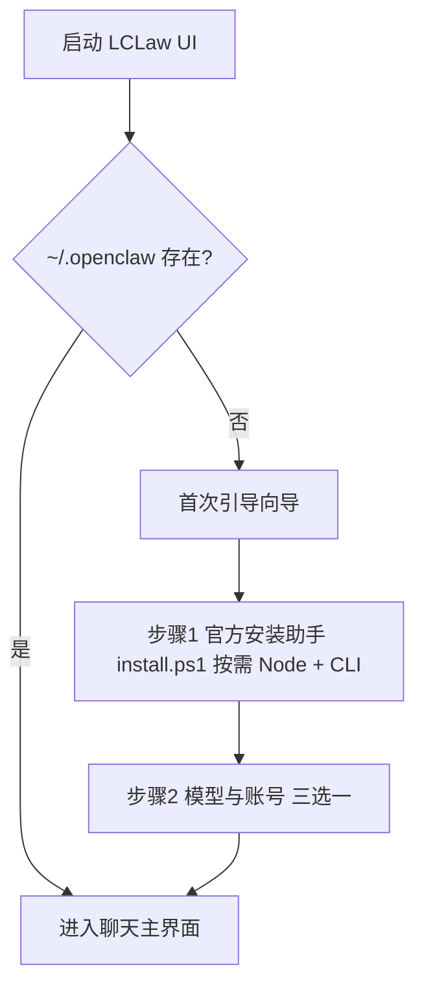

# LCLaw UI：安装与首次引导 — 实现方案

本文档综合**产品流程图（启动 → 环境检测 → 模型向导）**与**工程侧约束**（环境检测默认合并为**官方 `install.ps1` 一键安装**）（现有 `GatewayLocalDialog`、`ensure-openclaw-windows.ps1`、网关自启、Ollama 空密钥 `auth-profiles` 等），给出可落地的实现方案，目标为**小白友好**。

---

## 1. 目标与原则

- **默认路径**：用户尽量少读文档即可完成「助手可用 → 网关可达 → 模型可对话」。
- **环境安装默认只走官方**：以 **`https://openclaw.ai/install.ps1`**（经 `ensure-openclaw-windows.ps1` 子进程调用）为**唯一默认路径**，**一次搞定**按需 Node + OpenClaw CLI；向导**不单独拆「先装 Node」步骤**（与 [OpenClaw Install](https://docs.openclaw.ai/install) 一致）。手动 `npm -g` 等见 **§6.1** 高级场景。
- **检查-修复（check-and-fix）**：每一步失败都有明确下一步（按钮/自动重试/文档），避免只抛技术错误。
- **复用优先**：不重复维护一套配置模型；模型与账号配置继续走现有「本机设置」①②③ 的数据结构与 Rust 写入逻辑。
- **可跳过**：高级用户可跳过向导，但不作为默认。

---

## 2. 与流程图的对应关系

流程图描述的整体顺序与本方案一致，下表映射到具体实现落点。

| 流程图环节 | 实现落点 | 说明 |
|------------|----------|------|
| 双击打开 LCLaw UI | Tauri 应用正常启动 | 与现有一致。 |
| 检测 `~/.openclaw/` 是否存在 | Rust：`openclaw_dir()` 存在且可读 | **快速路径**：存在则**默认进入主界面（聊天）**；可选在首屏后台做一次**轻量预检**（网关端口、WS），失败再浮条引导「环境向导」。 |
| 不存在 → 进入引导向导 | 新路由/全屏页：`FirstRunWizard`（名称可调整） | 仅首次或用户从菜单主动打开「首次设置」。 |
| 步骤 1（环境）：官方一键装助手 | `resolve_open_claw_executable` + **`ensure-openclaw-windows.ps1`** | **默认仅此一步**：下载并子进程执行官方 `install.ps1`（`-NoOnboard`），由官方安装器**按需安装 Node** 再装 CLI；UI **进度条 + 日志**；成功以 **`openclaw --version`** 与 PATH 刷新为准。**不**在向导中单列 Node（见 **§6.1**）。 |
| 步骤 2：模型配置向导 | 复用 `GatewayLocalDialog` + **三选一入口** | 见 **§3.3**：**本机模型** / **云端 API Key** / **先跳过、稍后在设置里配置**；底层仍写入 `models.json` / `auth-profiles`；与流程图「测试 → 保存 → 开网关」对齐。 |

---

## 3. 详细流程设计

### 3.1 入口分支（与流程图对齐）

**建议增强（工程现实）**

- **仅目录存在不等于配置完整**：快速路径进入聊天后，若连接网关失败，用**非阻塞提示**引导打开「环境向导」或「本机设置」对应步骤，避免用户误以为「有文件夹就一定能用」。
- **持久化标记**：向导完成后写入本地状态（如 `localStorage` / Tauri store）：`first_run_wizard_completed_at`，便于升级后做**可选复检**。

### 3.2 步骤 1：官方一键安装 OpenClaw（含按需 Node）— **默认仅此环境步骤**

**产品定稿**：与旧流程图中「先 Node、再 CLI」的两段式不同，**LCLaw 向导默认合并为一步**：用户只面对「安装官方助手」；**Node 由官方 `install.ps1` 在需要时自动安装**，无需单独选版本或先装 Node。

**实现要点**

1. **检测**：与现网一致，`openclaw --version` / `resolve_open_claw_executable`；可在向导「高级」暴露自定义 `openclawExecutable`。  
2. **安装**：Windows 资源中附带 `ensure-openclaw-windows.ps1`（及 `.bat`），**子进程**下载 `https://openclaw.ai/install.ps1` 并执行 **`-NoOnboard`**；**禁止**在同进程 dot-source 官方脚本（与仓库脚本注释一致）。  
3. **参数策略（小白默认）**  
   - 推荐：`-OnboardAuthChoice skip` 或带 `FallbackToSkipAuthIfOllamaUnreachable` 的 ollama 分支，再执行非交互 `onboard`，保证 **CLI + 网关骨架**；模型细节在 **步骤 2** 完成。  
4. **日志与反馈**：子进程 `stdout`/`stderr` 增量展示；结束后 **同步 PATH**（同 `Sync-PathFromRegistry`）或提示**重启应用**；仍找不到 `openclaw` 时给 `npm prefix -g` 等官方排障链接（**§6.1**）。  
5. **非交互 onboard**：与脚本已有能力对齐；可封装为 Tauri 命令（见 **§5**）。

**高级（非默认）**：用户自行 `npm install -g openclaw` 时，需已具备符合官方版本的 Node，见 **§6.1**，不在主向导流程展开。

### 3.3 步骤 2：模型配置向导 — 三选一 + 流程图对齐

**流程图要求**：展示提供商列表 → 输入 API Key → **[测试连接]** → 保存 → 启动 Gateway。

**产品定稿（小白友好）**：进入「填写模型」环节时，先呈现 **三个互斥选项**（卡片或单选），用户择一进入子流程。**不要用「留空」作为选项文案**，以免与「本机 Ollama 不填密钥」混淆；第三项明确为 **「先跳过，稍后在设置里配置」**。

| 选项 | 展示名称（建议） | 用户要做什么 | 技术/产品要点 |
|------|------------------|--------------|----------------|
| **A** | **本机模型（Ollama）** | 确认或安装 Ollama；选择或填写模型名（如 `qwen2.5:7b`）；**无需填云端 API Key**。 | 检测 `127.0.0.1:11434`；保存 `ollama` provider + 默认 `primary`；密钥留空仍写 `auth-profiles` 占位（已实现）。 |
| **B** | **云端模型（填写 API Key）** | 选预设厂商（国内/国际快捷）或自定义兼容接口；粘贴 Key；**建议测试连接通过后再完成**。 | 嵌入或深链到现有 **GatewayLocalDialog** 的 ②③；与 §7 中 Pollinations / DeepSeek 等推荐一致。 |
| **C** | **先跳过，稍后在设置里配置** | 一键进入下一步/主界面；**不在此步绑定模型**。 | 等价于「本轮只完成环境骨架」：可与 **步骤 1** 的 `skip` 型 onboard 衔接；**必须**在进聊天后展示**持久、可点的提示**（横幅/空状态）：「尚未配置对话模型，去 本机设置 → …」；预检 API 中标记 `model_config_deferred: true` 供诊断使用。 |

**实现要点**

1. **单一数据源**：A/B 最终都调用与 **GatewayLocalDialog** 相同的写入命令（`writeOpenClawProvidersPatch`、默认模型 `primary` 等），仅**入口与步骤顺序**为向导定制；C 不写入模型与密钥，但可写本地向导状态。  
2. **测试连接**（A / B）：  
   - **Ollama**：`/api/tags` 或等价探测；失败则引导启动 Ollama 或更换模型名。  
   - **云端**：保存后或保存前发起**轻量请求**（由产品决定），失败则拦截「完成向导」或强提示。  
3. **网关**：A / B 在配置有效保存后调用 **ensure / restart gateway**；选项 C 仍可尝试**仅启动网关**（若已有 `openclaw.json`），但**不保证可对话**。  
4. **allowedOrigins**：与现网一致；失败时固定文案引导。  
5. **完成条件**：A / B 以「配置已保存 +（可选）测试通过」为推荐完成条件；C 以用户确认「我了解稍后要配置」为完成条件，避免误以为已能正常对话。

---

## 4. 后端聚合接口（推荐）

新增 **单一预检命令**（示例名：`get_openclaw_setup_status`），返回结构化 JSON，供：

- 首次向导各步骤判定；
- 主界面「诊断」按钮；
- 设置页顶部状态点。

**建议字段（示例）**

| 字段 | 含义 |
|------|------|
| `openclaw_dir_exists` | `~/.openclaw` 是否存在 |
| `openclaw_exe` | `found` / `path` / `error` |
| `node` | `found` / `version` / `error`（**可选**，仅诊断或高级路径；**默认向导不依赖此字段**） |
| `config` | `missing` / `invalid` / `ok`（`openclaw.json`） |
| `gateway` | 端口、`reachable`、简要错误 |
| `agent_auth_models` | 是否具备当前默认 agent 的模型与鉴权（可粗粒度） |
| `model_config_deferred` | 用户是否在向导中选择「先跳过」且尚未在设置中补全模型（可由本地标记 + 配置内容综合判断） |

与流程图的关系：**步骤 1～2** 尽量只读该接口 + 各步骤自己的「修复动作」，避免前端散落重复检测。

---

## 5. 里程碑建议

| 阶段 | 内容 | 验收 |
|------|------|------|
| **M1** | `~/.openclaw` 分支 + 向导壳 + 预检 API + 跳转现有设置步骤 | 无 OpenClaw 目录时必现向导；有目录时进聊天 |
| **M2** | **步骤 1 一体**：`ensure-openclaw-windows.ps1` + 官方 `install.ps1` + 日志视图 + PATH 提示；**不单独做 Node 向导页** | 干净 Windows 环境一次跑通后 `openclaw --version` 成功 |
| **M3** | **步骤 2**：模型**三选一** + 与 `GatewayLocalDialog` 复用 + C 的横幅/空状态 +「测试连接」细化 | 三种路径均可完成向导；选 C 时主界面明确提示未配置模型 |
| **M4** | NSIS/安装程序可选「一并执行官方安装脚本」 | 安装结束即减少步骤 1 失败率 |

---

## 6. 风险与决策点

### 6.1 Node.js 与官方安装：**产品默认 = 一次搞定，不单独向导步骤**

**官方口径**（与 `ensure-openclaw-windows.ps1` 下载的 `https://openclaw.ai/install.ps1` 一致）：推荐安装器会**检测系统并在需要时安装 Node**，再安装 OpenClaw。系统要求 **Node 24（推荐）或 Node 22.16+** 由脚本处理。详见 [OpenClaw Install](https://docs.openclaw.ai/install)、[Windows](https://docs.openclaw.ai/windows)。

**LCLaw 向导默认（已定稿）**

- **只做一步「安装官方助手」**：子进程跑官方 `install.ps1`，**不在 UI 中单列「安装 Node」**；与用户说的「**默认走官方、一次可以搞定**」一致。  
- **成功判据**：仅 **`openclaw --version`（或等价检测）** + PATH 刷新 / 必要时重启应用；与 `ensure-openclaw` 安装后 `Sync-PathFromRegistry` 一致。

| 场景 | 向导是否单独做 Node 步骤 | 说明 |
|------|--------------------------|------|
| **默认：官方 `install.ps1`** | **否** | Node 随官方安装器处理；失败时日志 + `openclaw doctor` + [Node setup](https://docs.openclaw.ai/install/node) 兜底。 |
| **高级：用户自行 `npm install -g openclaw`** | 不在主流程；文档或「高级」说明 | 需先 **`node -v` ≥ 22.16**（或与官方文档对齐 24）；**`npm prefix -g`** 与 PATH 见 [Troubleshooting](https://docs.openclaw.ai/install)。 |
| **装完仍异常** | — | **`openclaw doctor`**。 |

**判断方法（实现可简化为一条）**：优先检测 **`openclaw` 是否可用**；可用则视为运行时已就绪。**不必**在默认路径先检测 `node -v`。

### 6.2 权限与安全

- 官方 `install.ps1` 可能安装/升级 Node、注册计划任务等，可能触发 **UAC**；向导需一句说明「由官方安装程序处理」。  
- 子进程参数**写死为预设**，不接受用户粘贴任意 shell；日志展示注意 **API Key 脱敏**。

### 6.3 与「仅目录存在就进聊天」的平衡

流程图用 `~/.openclaw` 作为分叉条件，实现成本低、符合直觉。建议在**进入聊天后的首次连接**增加一次网关检测，失败则用**一条明确横幅**指向「完成环境向导」，减少「进了主界面却发不出消息」的挫败感。

---

## 7. 安装向导：推荐「免费 / 低成本」模型（产品文案与实现对齐）

面向小白时，向导里建议用**三档**呈现，避免把「公益」与「商业免费层」混为一谈；UI 上可用标签如 **「本机免费」「注册可用」「按量付费」**。

### 7.1 首推：本机 Ollama（真·零云费用、隐私好）

| 项 | 说明 |
|----|------|
| **适合谁** | 能装 Ollama、接受本机下载模型与占用显卡/CPU 的用户。 |
| **成本** | 无 API 账单；电费与磁盘为本机成本。 |
| **向导文案要点** | 「不用填密钥也可保存」；先检测 `http://127.0.0.1:11434`，未启动则链到 [Ollama 官网](https://ollama.com) 下载；提示 `ollama pull <模型名>`。 |
| **工程现状** | `ollama` 密钥留空仍会写入 `auth-profiles` 占位，避免网关报缺 Key；快捷模型见 `PRIMARY_MODEL_QUICK_PICKS` 中 Ollama 项。 |

**向导内推荐默认模型 ID（易拉取、通用）**：`qwen2.5:7b` 或 `llama3.2`（与 `openclaw-presets.ts` 中已有快捷项一致）；若面向中文用户可优先文案推荐 **Qwen 系列**。

### 7.2 次推：Pollinations（OpenAI 兼容，脚本已对齐）

| 项 | 说明 |
|----|------|
| **适合谁** | 不想跑本机大模型、能接受注册 API Key 的用户。 |
| **成本** | 以官方 [Pollinations](https://pollinations.ai) / [enter.pollinations.ai](https://enter.pollinations.ai) 当前政策为准（通常有免费层或试用，**会变更**）。 |
| **对接方式** | `baseUrl`：`https://gen.pollinations.ai/v1`，`api`：`openai-completions`；与 `scripts/ensure-openclaw-windows.ps1` 中非交互 onboard 的 Pollinations 分支一致。 |
| **向导实现** | 步骤 2 可提供「一键填好地址 + 模型 ID（如 `openai`）」模板，用户只粘贴 Key；**测试连接**走最小请求。 |
| **与「公益 AI」** | 若产品希望强调公益叙事，可把文案写成「低门槛试用 / 开放生态」类表述，**勿代厂商承诺永久免费**；具体条款链到官方说明。 |

**可选工程后续**：在 `lclaw-ui/src/lib/openclaw-presets.ts` 的 `PROVIDER_SETUP_PRESETS` 中增加 Pollinations 预设，与设置页「国内/国际快捷」一致，减少手工输入 URL。

### 7.3 备选：国内「新人免费额度」类 OpenAI 兼容网关

| 项 | 说明 |
|----|------|
| **适合谁** | 需要国内网络友好、愿意手机号/实名注册领额度的用户。 |
| **成本** | 各平台活动不同，**额度与模型名会调整**，向导内应写「以官网为准」并支持用户改 `baseUrl`/模型 ID。 |
| **实现注意** | 不宜写死为「永久免费」；适合放在「更多提供商」折叠区，由用户自选。 |

### 7.4 不推荐作为向导「默认免费」的项

- **OpenRouter [Free Models Router](https://openrouter.ai/openrouter/free)（模型 ID 填 `free`，即 API 的 `openrouter/free`）**：能零费用试通，但池内多为小模型、质量不稳定，**不适合龙虾 / LCLaw 主力法律助手**；仅可作「试连通」或玩票。正经使用请用本机 Ollama 拉更大模型，或 OpenRouter 上带 `:free` 以外的指定模型 / `openrouter/auto`（按量付费）。
- **需付费或强绑信用卡** 的主流商业 API（OpenAI、Anthropic 等）：可作为「我有密钥」高级入口，不要当默认免费推荐。
- **名称含「公益」但无稳定开放 API 文档** 的平台：除非拿到明确兼容方式与条款，否则不放进默认三步，避免无法「测试连接」或很快失效。

### 7.5 向导 UI 建议（与 §3.3 三选一一致）

1. **第一层（步骤 2 入口）**：三张并列卡片 — **本机模型（Ollama）** / **云端模型（API Key）** / **先跳过，稍后在设置里配置**；文案避免使用「留空」指代第三项。  
2. **第二层**：  
   - 选 **本机**：展示 Ollama 检测、模型下拉/快捷项（参见 §7.1）。  
   - 选 **云端**：展示厂商快捷或进入与 ②③ 一致的表单；可选 Pollinations 等（§7.2、§7.3）。  
   - 选 **跳过**：二次确认一句：「进入主界面后需打开本机设置完成模型配置，否则无法对话」。  
3. **测试连接**（本机/云端）：成功后再允许「完成向导」为**推荐**路径；跳过路径不要求测试通过。  
4. **卡片排序（仅针对云端内的厂商）**：本机相关不出现在「云端」子列表首位混淆；云端内部排序仍可为国内常用 → 国际 → 自定义。

---

## 8. 相关仓库资产（实现时对照）

| 资产 | 路径/说明 |
|------|-----------|
| Windows 一键脚本 | `scripts/ensure-openclaw-windows.ps1`、`scripts/ensure-openclaw-windows.bat` |
| 网关发现与自启 | `lclaw-ui/src-tauri/src/openclaw_gateway.rs` |
| 提供商与 auth 写入 | `lclaw-ui/src-tauri/src/openclaw_providers.rs`（含 Ollama 空密钥占位） |
| 本机设置 UI | `lclaw-ui/src/features/settings/GatewayLocalDialog.vue` |
| 提供商预设与快捷模型 | `lclaw-ui/src/lib/openclaw-presets.ts` |
| OpenClaw 官方 onboard | 上游 `openclaw onboard` / 非交互参数（与脚本注释中的文档链接一致） |

---

## 9. 小结

本方案**以流程图为骨架**（目录检测分流 → **官方一键环境** → 模型 GUI），**以现有 LCLaw 实现为血肉**；环境阶段**默认只走官方 `install.ps1`（含按需 Node），一次搞定，不单独拆 Node 向导页**。**步骤 2（模型）** 采用 **本机 Ollama / 云端 API Key / 先跳过稍后在设置配置** 三选一，避免「留空」歧义，并为跳过路径强制**主界面引导补配置**。通过 **预检 API**（含 `model_config_deferred`）与 **聊天后弱检测** 补齐「仅有目录不完全就绪」的现实缺口；**免费模型路径**以 **本机 Ollama 为主、Pollinations 等为云侧低门槛备选**，**不把 OpenRouter 免费路由当龙虾主力**。按 **M1→M4** 迭代可在控制复杂度的前提下达到**小白友好**目标。
